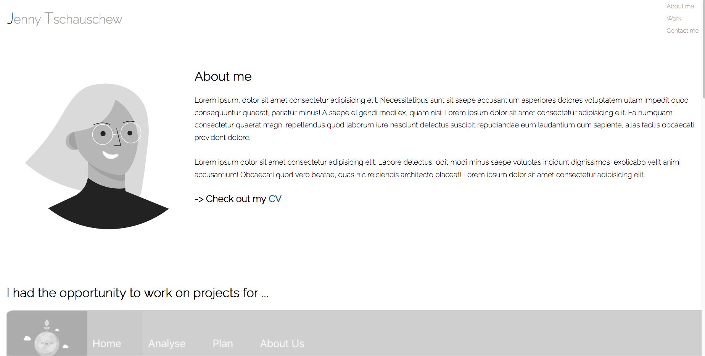
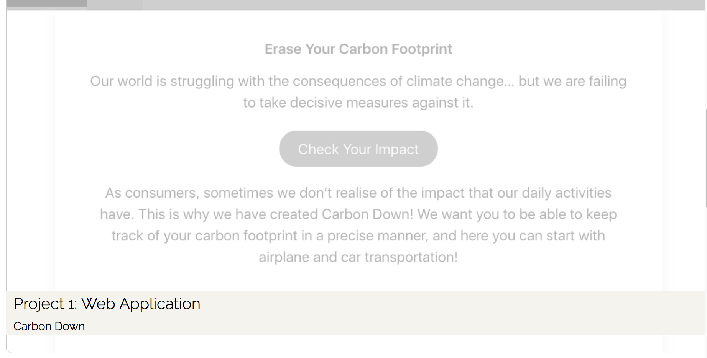
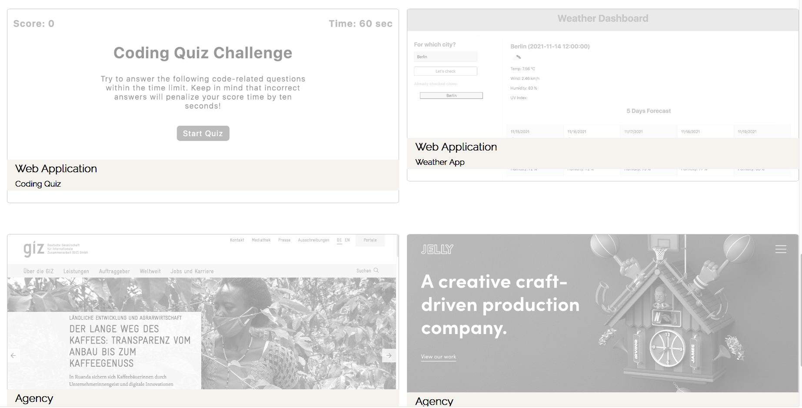
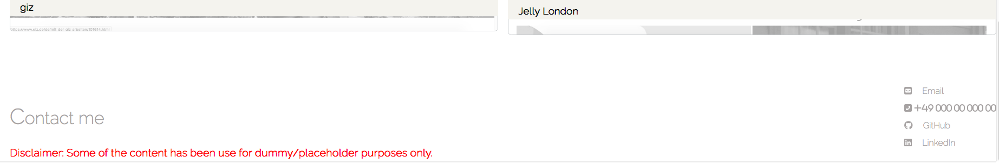

# Homework-02_Portfolio

**##Description**
This project refers to a index.html and style.css file which contains the code for a dummy-profile webpage. The profile itself states the name, a about me section, showing some expamle projects and the contact details as well as a link to GitHub and LinkedIn Profile. It gives a general and very quick overview what kind of web development experience the profile owner brings along or to which projekt she has contributed.

**##Building Structure\*\***

HTML

// Head:contains link to font-awesome + link to the stylesheet css
// Header: Name + Navigation (starting at line 13)
// Avatar + Section "About me + CV download" (starting at line 13)
// Section: "H3" + "Big project example" incl. link (starting at line 40)
// Section: "Four small project examples" incl. links (starting at line 54)
// Footer: (starting at line 102)

CSS

// Contains all the design on semantic elements, sections, classes and id

**Screenshots**

**Tech/Framwork used**
HTML
CSS
Images
pdf
Internal/External links

**Repositery content + link**
assets folder (styles.css, images, pdf)
index.html
README.md

GitHub (dev branch): https://github.com/JenBerlin/Portfolio/tree/dev
GitHub page: @Dom: not sure how to add the page from the dev branch; is it at all possible?
